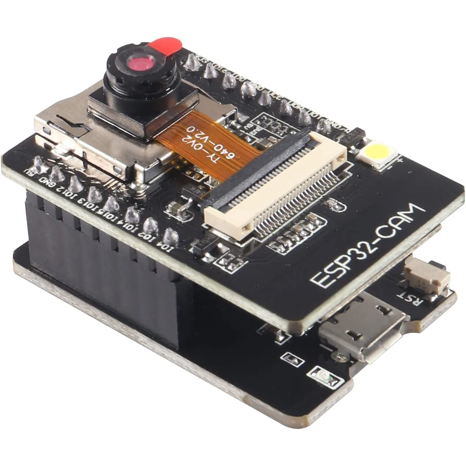

# ESP32 CAM стрим в топик ROS2 jazzy




## Минимальная конфигурация
### Нужно:
- ПК с ros2 jazzy
- WiFi роутер
- Esp32Cam, *ai-thinker esp32-cam, как на картинке выше*

### Шаги для воспроизведения
#### Код
##### Прошить Esp32cam, будет на примере платы с переходником для прошивки, как выше
- Подключить к пк
- Поставить [драйвер](https://wiki.amperka.ru/articles:driver-ch340) для CH340C
- В Arduino ide 2 добавить esp32 плату, [гайд](https://wiki.iarduino.ru/page/esp32-windows/)
- Поменять настройки в скетче
- Прошить :)
##### Тестовый запуск
- Поставить библиотеки
```shell
pip install -r requirements.txt
```
- Запустить скрипт
```shell
python3 udp_test.py
```
##### Запуск ноды
- Собрать пакет
```shell
colcon build --packages-select esp32listener
```
- Запуск
```shell
ros2 run esp32listener esp32listener
```