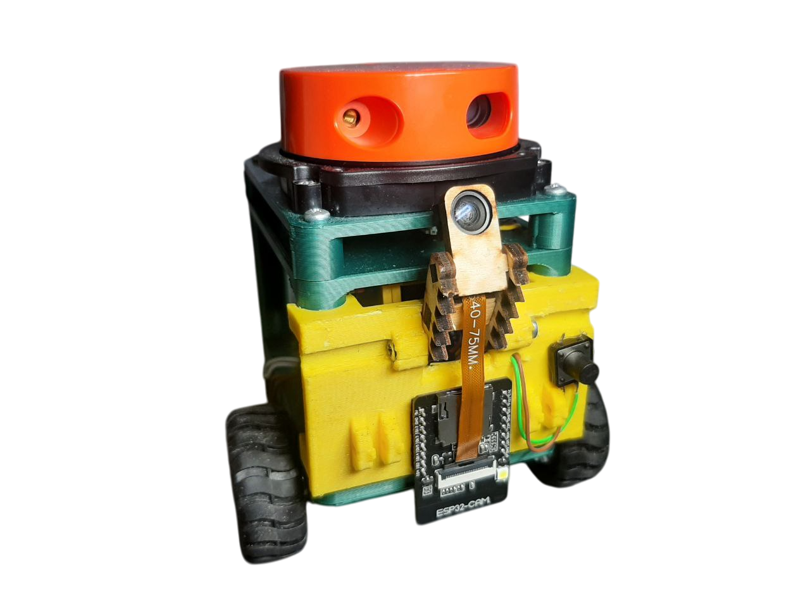
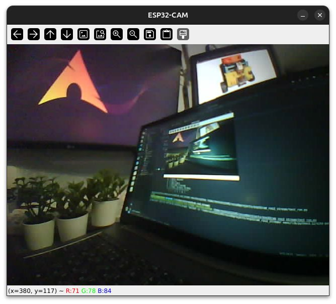
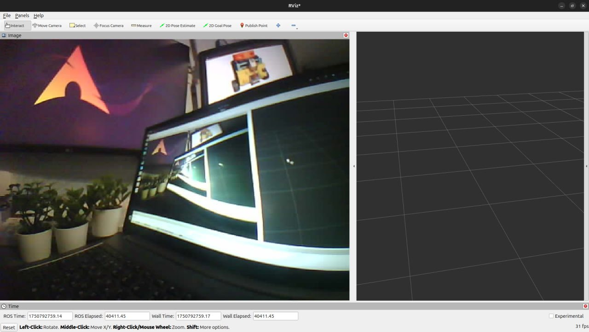

# ESP32 CAM [rosik](https://github.com/stepanburmistrov/ROSik) addon




### Требуется:
- ПК с ros2 jazzy
- WiFi роутер
- Esp32Cam, *ai-thinker esp32-cam, как на картинке ниже*


### Шаги для воспроизведения
#### Код
##### Прошить Esp32cam, будет на примере платы с переходником для прошивки, как выше
- Подключить к пк
- Поставить [драйвер](https://wiki.amperka.ru/articles:driver-ch340) для CH340C
- В Arduino ide 2 добавить esp32 плату, [гайд](https://wiki.iarduino.ru/page/esp32-windows/)
- Поменять настройки в скетче
- Прошить
- Настроить, отправив один раз в сериал порт команду типа
```
<wifi ssid>|<wifi password>
```
- Дождаться пока подключится к wifi, и выведет ip адрес

##### Тестовый запуск
- Поставить библиотеки
```shell
pip install -r requirements.txt
```
- Запустить скрипт
```shell
python3 test_run.py
```


##### Запуск ноды
- Собрать пакет
```shell
colcon build --packages-select esp32listener
```
- Запуск
```shell
ros2 run esp32listener esp32listener --ros-args -p esp_ip:=<esp32cam ip>
```

- Теперь можно добавить в rviz2 топик `image_raw`


##### Индикация ошибок
- В случае если светодиод на плате(вспышка на 4ом пине) включается больше чем на секунду, то наиболее вероятно произошла ошибка инициализации камеры, и рекомендуется:
    - Перезагрузить плату, если не помогло шаг ниже
    - Поправить шлейф камеры, распрямить его